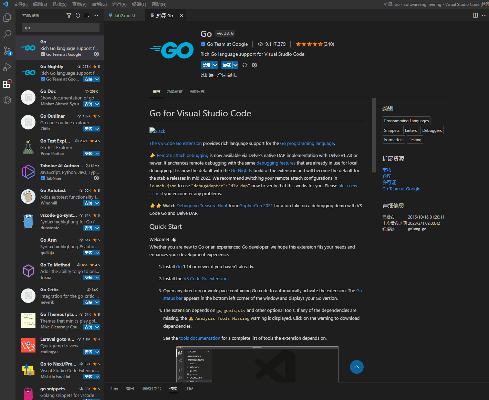

# 高软Lab2

## 实验要求

选用go或rust编写menu项目，创建一个版本库（gitee或github），采用VS Code作为编译调试环境。撰写一个帖子，从创建版本库、配置VS Code编译调试环境、编写menu第一版简单程序，以及最终调试运行，完整记录下来，目标是为go或rust的开发者提供一个开发环境配置和工作流程的参考。

## 实验步骤

### 建立 Github 仓库


### 安装 Go

按照以下步骤安装 Go：

1. 在 Web 浏览器中，转到 “[go.dev/doc/install](go.dev/doc/install)”
2. 下载操作系统的版本
    
3. 下载后，运行安装程序
4. 打开命令提示符，然后运行 go version 以确认已安装 Go
    

### 安装Visual Studio Code

按照以下步骤安装Visual Studio Code：

1. 在 Web 浏览器中，转到 “[code.visualstudio.com](code.visualstudio.com)”
2. 下载操作系统的版本
3. 下载后，运行安装程序
   
### 安装 Go 扩展

1. 在“Visual Studio Code”中，单击活动栏中的“扩展”图标，打开“扩展”视图。 或者 (Ctrl+Shift+X) 使用键盘快捷方式
2. 搜索 Go 扩展，然后选择“安装”
    

### 更新 Go 工具

1. 在Visual Studio Code中，打开命令面板的“帮助>显示所有命令”，或者使用键盘快捷方式 (Ctrl+Shift+P)
2. Go: Install/Update tools搜索，然后从托盘运行命令
   - 如果出现错误 ***命令go install/update tools导致错误***，请配置环境变量：
3. 出现提示时，选择所有可用的 Go 工具，然后单击“确定”
    
4. 等待 Go 工具完成更新
    

### 编写Menu程序

```go
package main
 
import "fmt"
 
func main() {
	var cmd string
	for {
		fmt.Print("Please input a command: ")
		fmt.Scanln(&cmd)
		switch cmd {
		case "help":
			fmt.Println("This is help command.")
		case "quit":
			fmt.Println("Quit.")
			return
		default:
			fmt.Println("Wrong command!")
		}
	}
}
```

### 运行结果


### 推送到 GitHub


学号后三位：508