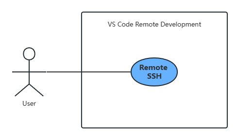

# 作业4：从需求分析到软件设计

学号后三位：508

以VS Code Remote Development相关功能为例，选择一个用例进行需求分析和逆向工程，按课堂要求完成一篇博客文章。
- https://code.visualstudio.com/
- https://github.com/microsoft/vscode

## VS Code Remote Development简介

VS Code Remote Development是Visual Studio Code（VS Code）的一个功能，它允许开发人员在远程服务器上进行代码编辑、调试和运行。它提供了一种快速、高效和安全的方式，让开发人员可以在本地计算机上使用VS Code的编辑器和调试器来与远程服务器上的应用程序进行交互。她提供了多种连接方式，包括SSH、Windows远程桌面等，并且它支持多种操作系统，如Windows、Linux和macOS等。它还提供了一些功能，如认证和安全、转发端口、文件传输、环境配置等，以便开发人员可以在远程服务器上进行高效的开发工作。

## 用例
开发者在本地使用VS Code Remote Development连接到远程主机。

根据准确提取用例的基本方法，很容易可以得到：
- System：VS Code Remote Development
- Actor：User
- Use Case：Remote connection

用例图如下：

## 需求分析

1. 支持多种连接协议和验证方式：远程连接功能需要支持多种连接协议和验证方式，例如 SSH、Windows 远程桌面、Docker 容器等，以便连接到不同类型的远程主机。

2. 提供可视化的连接管理界面：远程连接功能需要提供一个可视化的连接管理界面，以便用户可以添加、编辑、删除和测试连接配置，并查看连接状态和信息。

3. 支持连接配置的导入和导出：远程连接功能需要支持连接配置的导入和导出，以便用户可以轻松地在不同计算机之间共享和备份连接配置。

4. 提供快速连接和断开连接的功能：远程连接功能需要提供快速连接和断开连接的功能，以便用户可以快速地连接和断开与远程主机的连接。

5. 支持连接状态的监控和通知：远程连接功能需要支持连接状态的监控和通知，以便用户可以及时了解连接状态的变化和故障信息。此功能可以通过在界面上显示连接状态和错误提示，或者通过发送通知消息的方式实现。

6. 支持自动重连和断线重连：远程连接功能需要支持自动重连和断线重连功能，以便在网络故障或连接中断的情况下自动重新连接远程主机，保证连接的可靠性和稳定性。

## 逆向工程

根据<https://github.com/microsoft/vscode-remote-release/blob/main/NOTICE-remote-ssh.txt>可以看到，在 VS Code Remote Development 通过 SSH 连接到远程主机的过程中，采用了许多第三方软件实现对应功能，以下为几个例子

1. [async-listener 0.6.10 - BSD-2-Clause](https://github.com/othiym23/async-listener#readme)
This is an implementation of Trevor Norris's process.{addAsyncListener,removeAsyncListener} API for adding behavior to async calls.

2. [shimmer 1.2.1 - BSD-2-Clause](https://github.com/othiym23/shimmer#readme)
Safer monkeypatching for Node.js

3. [emitter-listener 1.1.2 - BSD-2-Clause](https://github.com/othiym23/emitter-listener)
Add dynamic instrumentation to emitters